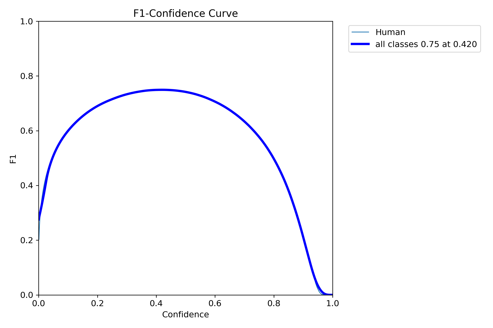
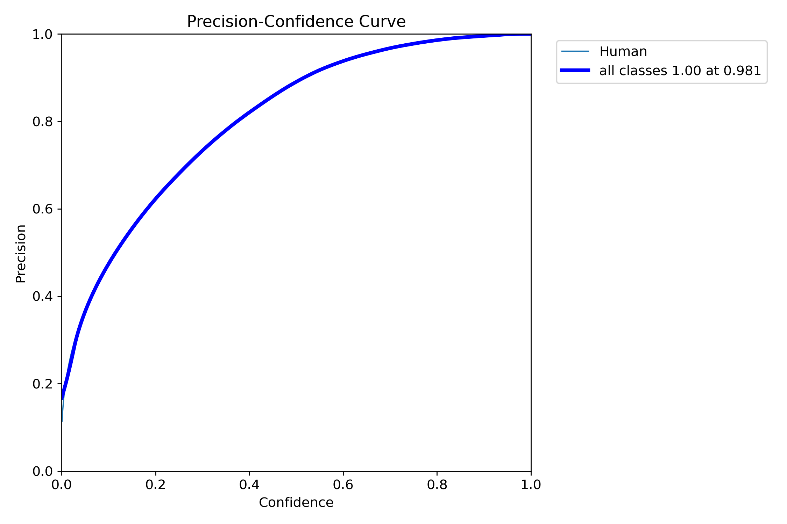
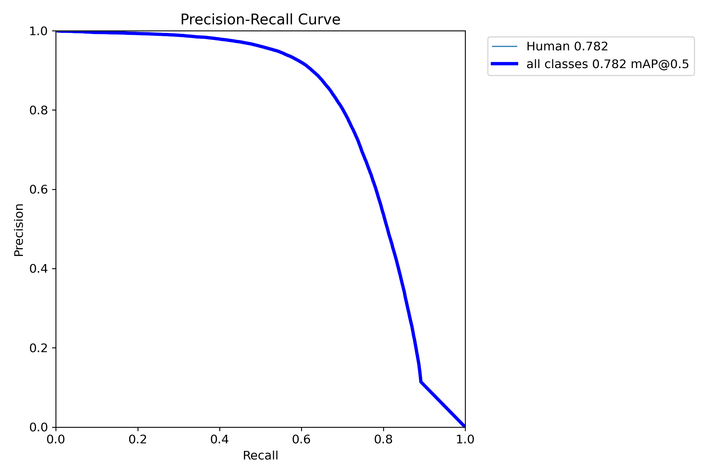
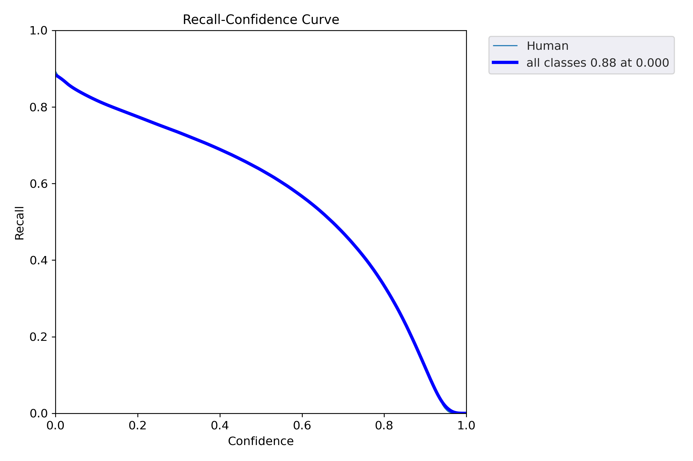
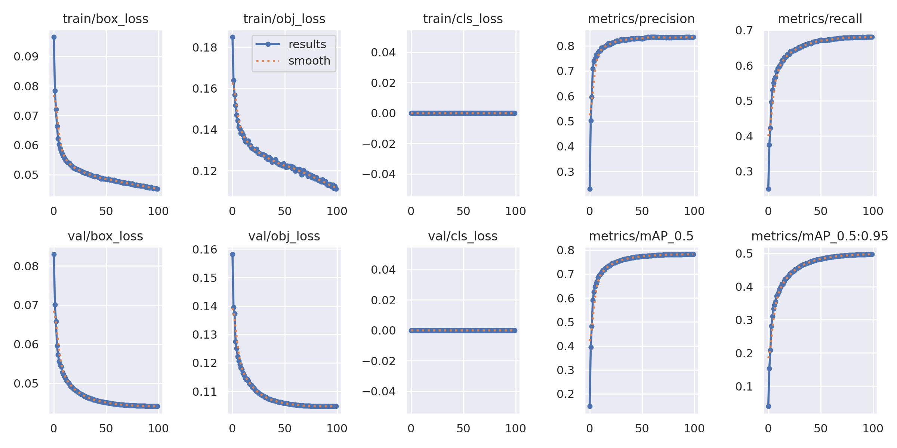
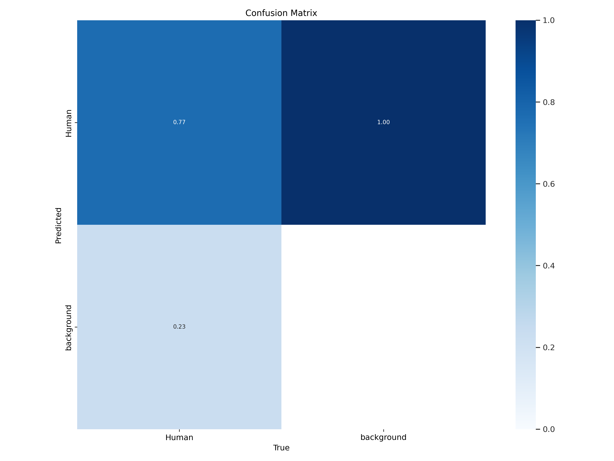
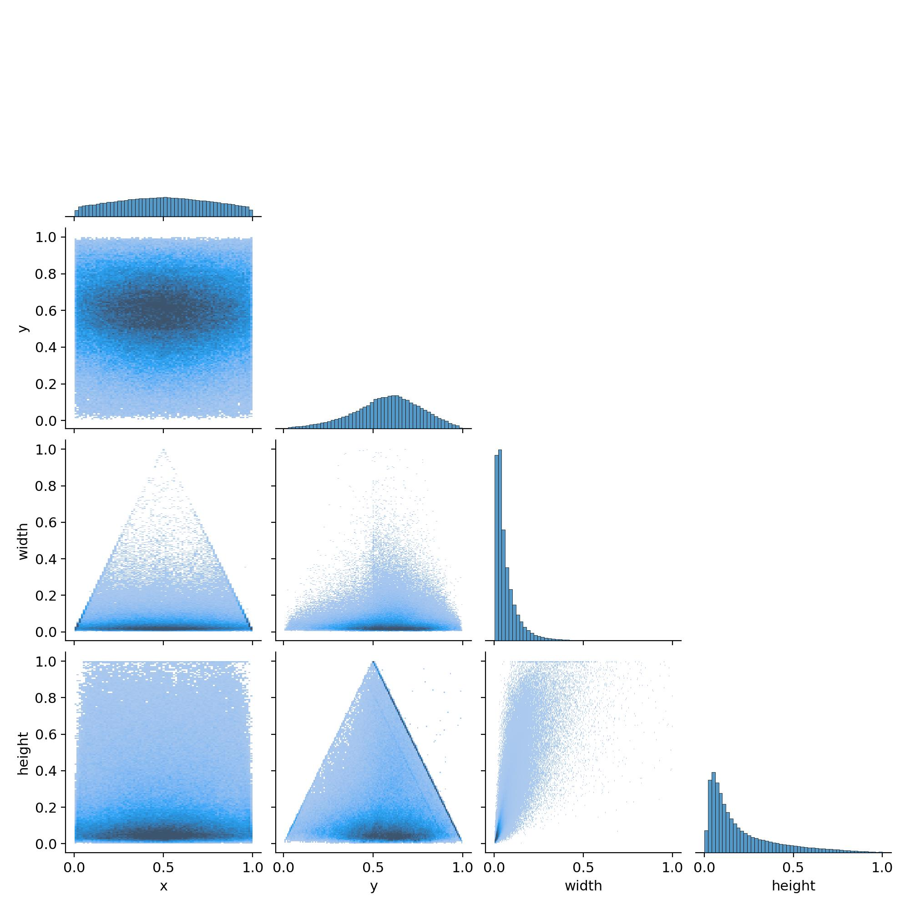
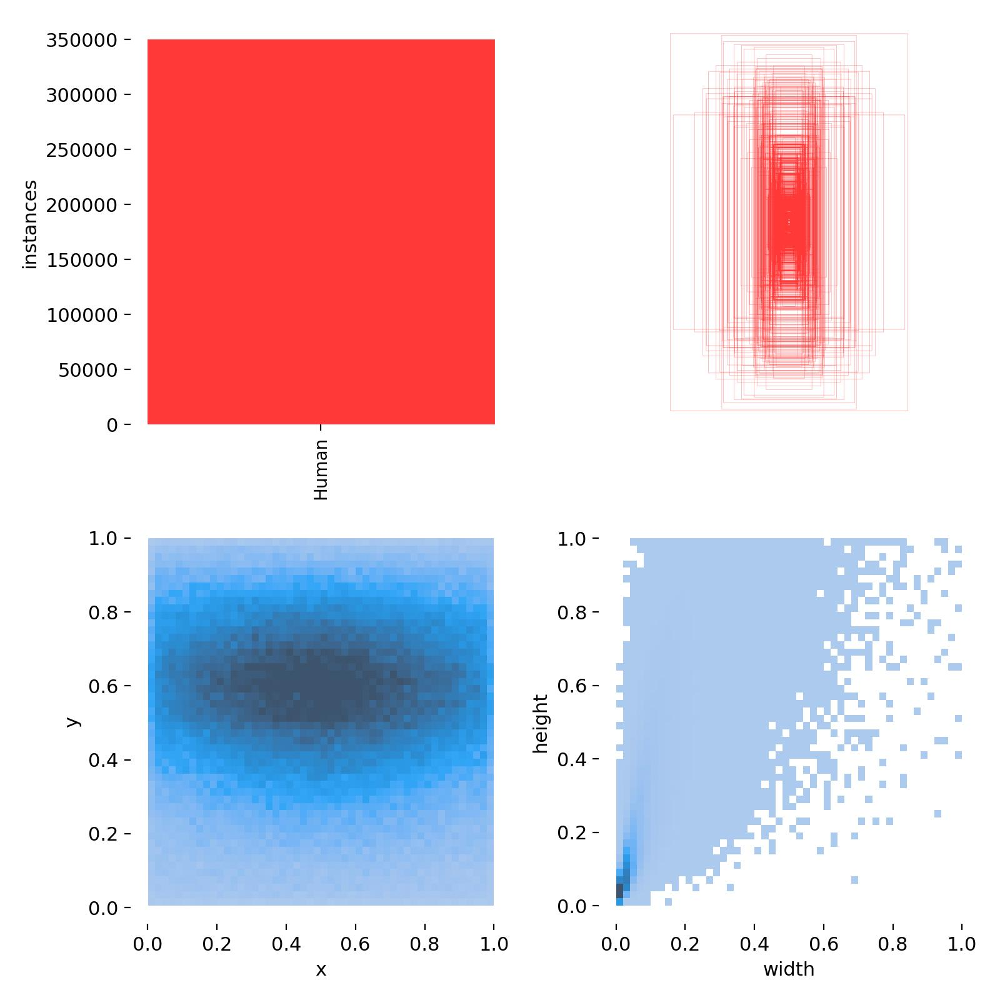
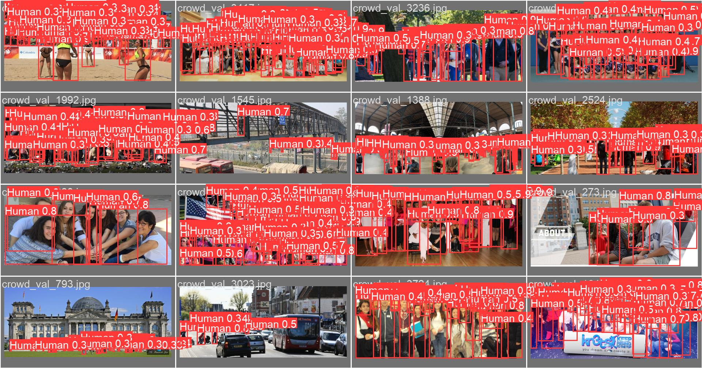

# Human Detection, Tracking and counting

<div align="center">
<p float="left">
  <a href="https://youtu.be/jV6iQ9GOkj4"></a>
</p>
</div>
<div align="center">
<p float="left">

  <a href="https://youtu.be/DSO-4VsWjX8"></a>
</p>
</div>


<summary><b>Introduction</b></summary>

In this repository I have trained yolov5m on crowdhuman dataset, tracked and counted humans using motion based and highly pluggable two-stage state-of-the-art multi-object trackers.

<details>

<summary><b>Training yolov5m and Dataset Preparation </b></summary>

The included code, which is in form of Ipython Notebook, downloads the dataset and perform processing.

### Colab Notebook

The code needed to preprocess the data and train the model is available in the following notebook.
Set the runtime to GPU and run everything.

[](https://github.com/muhammad-umair-usmani/Human_Detection_Tracking_Counting/blob/main/Dataset_Preparation_Yolov5m_Training.ipynb)

<summary><b> Yolov5 Weights and checkpoint to resume training </b></summary>

The newly trained [weights](https://github.com/muhammad-umair-usmani/Human_Detection_Tracking_Counting/blob/main/yolov5/runs/train) for human detection are also available to run using the official yolov5 code found [here](https://github.com/ultralytics/yolov5)


<summary><b>Finally yolov5m is trained. Below are training metrics and performance images</b></summary>

<p float="left">
  
  
  
  
</p>
<p float="left">
  
</p>

<p float="left">
  
</p>

### labels correlogram
<p float="left">
  
  
</p>

### Results
<p float="left">
  
</p>

</details>

<details>

<summary><b>Inference</b></summary>

YOLOv5 [PyTorch Hub](https://docs.ultralytics.com/yolov5/tutorials/pytorch_hub_model_loading) inference. [Models](https://github.com/ultralytics/yolov5/tree/master/models) download automatically from the latest YOLOv5 [release](https://github.com/ultralytics/yolov5/releases).

### Find custom trained weights for only pedestrian detection [Link](https://github.com/muhammad-umair-usmani/Human_Detection_Tracking_Counting/blob/main/yolov5/run/train)

```python
import torch

# Model
model = torch.hub.load("./yolov5", 'custom', path=args.yolo_model, source='local')# or yolov5n - yolov5x6, custom

model.conf = 0.5 # confidence threshold
model.iou =  0.7 # intersection over union (IoU) threshold for NMS

# Images
img = "https://ultralytics.com/images/zidane.jpg"  # or file, Path, PIL, OpenCV, numpy, list

# Inference
results = model(img)

# Results
results.print()  # or .show(), .save(), .crop(), .pandas(), etc.
```
</details>

<details>
<summary><b>Inference with detect.py</b></summary>

`detect.py` runs inference on a variety of sources, downloading [models](https://github.com/ultralytics/yolov5/tree/master/models) automatically from the latest YOLOv5 [release](https://github.com/ultralytics/yolov5/releases) and saving results to `runs/detect`.

```bash
python detect.py --weights yolov5s.pt --source 0                               # webcam
                                               img.jpg                         # image
                                               vid.mp4                         # video
                                               screen                          # screenshot
                                               path/                           # directory
                                               list.txt                        # list of images
                                               list.streams                    # list of streams
                                               'path/*.jpg'                    # glob
                                               'https://youtu.be/LNwODJXcvt4'  # YouTube
                                               'rtsp://example.com/media.mp4'  # RTSP, RTMP, HTTP stream
```

</details>

<details>

<summary><b>Human Tracking and Counting</b><summary>

<b>For Human detection, Tracking and Counting, utilize the [](https://github.com/muhammad-umair-usmani/Human_Detection_Tracking_Counting/blob/main/human_detection_tracking_counting.ipynb)</b>

<details>
<summary><b>Tracking methods</b></summary>

```bash
$ python track.py --tracking-method deepocsort
                                    strongsort
                                    ocsort
                                    bytetrack
                                    botsort
```
</details>

<details>
<summary>Select ReID model</summary>

Some tracking methods combine appearance description and motion in the process of tracking. For those which use appearance, you can choose a ReID model based on your needs from this [ReID model zoo](https://kaiyangzhou.github.io/deep-person-reid/MODEL_ZOO). These model can be further optimized for you needs by the [reid_export.py](https://github.com/mikel-brostrom/yolo_tracking/blob/master/boxmot/deep/reid_export.py) script

```bash
$ python examples/track.py --source 0 --reid-model lmbn_n_cuhk03_d.pt               # lightweight
                                                   osnet_x0_25_market1501.pt
                                                   mobilenetv2_x1_4_msmt17.engine
                                                   resnet50_msmt17.onnx
                                                   osnet_x1_0_msmt17.pt
                                                   clip_market1501.pt               # heavy
                                                   clip_vehicleid.pt
                                                   ...
```

</details>

<details>

```bash
$ python track.py --tracking-method strongsort 
                  --reid-model osnet_x1_0_dukemtmcreid.pt  
                  --yolo-model ./crowd_human_best.pt
                  --input-path ./video/crowd_street.mp4 
                  --output-path ./video/output_crowd_street.mp4
```
</details>
</details>


